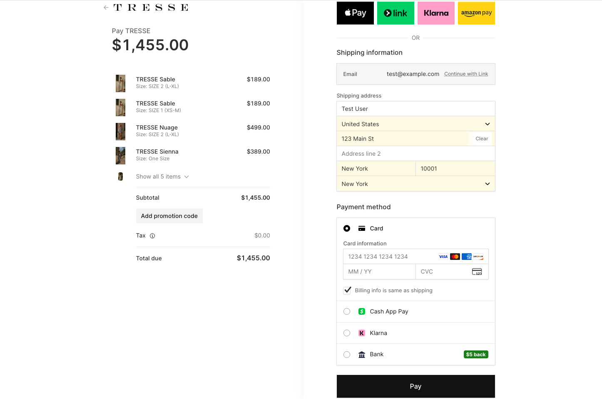

<div align="center">

# TRESSE

**A production e-commerce platform for handmade knitwear — built end-to-end, deployed live, and tested at every layer.**

[](https://tressehandmade.com/)
[](https://github.com/kseniiaross/tresse-ecommerce/actions)


[Live Demo](https://tressehandmade.com/) · [Backend](./tresse_backend) · [Frontend](./tresse_frontend)

</div>

---

## Overview


TRESSE is a full-stack e-commerce site selling handmade knitwear, built with a **Django REST API** and a **React/TypeScript SPA**. It handles real money — live Stripe payments, inventory that can't oversell under concurrent load, and account security (JWT + optional 2FA) — and every one of those paths is covered by an automated test suite, not just eyeballed in the browser.

This isn't a tutorial clone. It's a real, deployed store with the messiness that comes with that: custom-length garments priced per centimeter, guest carts that merge into an account on login, back-in-stock notifications, self-serve returns within a policy window, and a checkout flow that has to stay correct even when two requests hit it at the same time.

> **[tressehandmade.com](https://tressehandmade.com/)**


---

## Tech Stack

<table>
<tr>
<td valign="top" width="50%">

### Backend
- **Django 6** + **Django REST Framework**
- **PostgreSQL**
- **Stripe** — checkout sessions, webhooks, refunds
- **SimpleJWT** — token auth with rotation & blacklist
- **django-otp** — two-factor authentication
- **django-filter** — catalog filtering
- **Cloudinary** — media storage
- **Sentry** — error monitoring
- **Anymail** — transactional email

</td>
<td valign="top" width="50%">

### Frontend
- **React 19** + **TypeScript**
- **Redux Toolkit** — cart, auth, wishlist state
- **React Router 7**
- **React Hook Form** + **Yup** — form validation
- **Stripe.js** / React Stripe Elements
- **Axios**
- **Vite**

</td>
</tr>
<tr>
<td valign="top">

### Quality & Tooling (Backend)
- **Ruff** — lint + format
- **pytest** + **pytest-django**
- **PostgreSQL** in CI (GitHub Actions service container)

</td>
<td valign="top">

### Quality & Tooling (Frontend)
- **Biome** — lint + format, including a11y rules
- **Stylelint** — CSS
- **Vitest** + **Testing Library** — unit/integration tests
- **Playwright** — randomized stress ("monkey") testing

</td>
</tr>
</table>

**CI/CD:** GitHub Actions runs the full backend and frontend suites — lint, static checks, and tests — on every push.

---

## Key Features

**Storefront**


- Full product catalog with filtering, search, and sort
- Size and color variant selection
- Custom-length garments with per-centimeter surcharge pricing
- Custom-measurement capture for made-to-order pieces
- Wishlist with back-in-stock email notifications

**Cart & Checkout**



- Guest cart (localStorage) that automatically merges into the account cart on login
- Server-side cart signature verification — prevents price or quantity tampering between the client and Stripe checkout
- Real Stripe Checkout integration with webhook-driven order confirmation
- Idempotent webhook handling — safe against Stripe's at-least-once delivery and duplicate events
- Row-level stock locking to prevent overselling when multiple checkouts race for the same inventory

**Account & Orders**

- JWT authentication with token rotation and blacklist, optional 2FA
- Rate-limited login/registration endpoints
- Soft-delete account flow with a time-boxed, token-based restore link
- Order history with self-serve cancellation (24-hour window) and returns (14-day window)

**Accessibility**
- Full keyboard navigation across dialogs, dropdowns, and menus
- Managed focus (trap on open, restore on close) for every modal in the app
- Semantic HTML and ARIA audited and enforced via linting, not just spot-checked

---

## Testing

Testing here isn't a checkbox — it's how several real bugs in this codebase were actually found and fixed (see below). The suite spans backend business logic, frontend state and forms, full user flows, and unscripted stress testing.

| Layer | Tool | Coverage | Status |
|---|---|---|---|
| **Backend** | pytest | 114 tests — auth, orders & Stripe webhooks, cart/inventory, catalog, newsletter | ✅ passing |
| **Frontend (unit/integration)** | Vitest + Testing Library | 203 tests across 16 files — Redux slices, API error handling, every major page and form | ✅ passing |
| **Frontend (stress test)** | Playwright | 150 seeded randomized actions — clicks, garbage input, navigation, modal toggling | ✅ 0 crashes, 0 unhandled exceptions |
| **Lint / static analysis** | Ruff · Biome (incl. a11y) · Stylelint | Full backend and frontend, including CSS | ✅ 0 errors |

### What's actually exercised

- **The money path, end to end:** add to cart → Stripe checkout session → webhook confirmation → order creation, including duplicate-webhook idempotency and out-of-stock rejection under concurrent requests.
- **Auth, the whole lifecycle:** registration, login, password reset and change, soft-delete, and time-boxed account restore.
- **Cart correctness in both modes:** guest (localStorage) and authenticated (server), including the merge-on-login flow and price recalculation for custom-length items.
- **Every major page:** catalog, product detail, cart, checkout, order history, wishlist, dashboard — rendered, interacted with, and asserted against real component markup, not just smoke-tested.
- **Randomized stress testing:** a seeded Playwright script performs 150 unscripted actions — including feeding form inputs deliberately malformed data (extreme-length numbers, null bytes, control characters) — specifically to catch the crashes that hand-written test cases don't think to look for. Latest run: zero crashes, zero blank pages, zero unhandled exceptions. Reproducible with `npm run test:monkey`.

### Bugs found and fixed through testing

Writing this suite surfaced real defects, not just markup mismatches:

- **A focus-management race condition was silently truncating user input** in modal forms (e.g. the "notify me when back in stock" email field). Every parent re-render handed the dialog a fresh close-handler reference, which re-triggered a focus effect and yanked keyboard focus back into the dialog after every keystroke — so a user could type only one character before losing focus entirely. Root-caused to a `useEffect` dependency issue, fixed by moving the handler behind a ref so the effect only re-runs on the dialog's own open/close state, and generalized into a shared hook applied across every modal in the app.
- **Server-side validation messages were being silently discarded** on the login and registration forms. The API layer correctly extracted a specific, actionable error (e.g. "that email is already registered"), but the UI components re-wrapped it in a way that could never actually surface it — every failure, regardless of cause, fell back to a generic message. Traced to the exact point in the error-handling chain where the message was lost and fixed on both forms so users see the real reason a submission failed.

---

## Getting Started

### Prerequisites
- Python 3.12+, Node 22+, PostgreSQL

### Backend
```bash
cd tresse_backend
python -m venv venv && source venv/bin/activate
pip install -r requirements.txt
cp .env.example .env      # fill in SECRET_KEY, DB credentials, Stripe keys, etc.
python manage.py migrate
python manage.py runserver
```

### Frontend
```bash
cd tresse_frontend
npm install
cp .env.example .env      # fill in VITE_API_URL, Stripe publishable key, etc.
npm run dev
```

### Running the test suite
```bash
# Backend
cd tresse_backend && pytest

# Frontend
cd tresse_frontend
npm run test:run      # unit/integration tests
npm run lint            # Biome, including accessibility rules
npm run test:monkey     # randomized stress test
```

---

## Project Structure

```
tresse-ecommerce/
├── tresse_backend/              Django REST API
│   ├── accounts/                 Auth, profiles, 2FA
│   ├── orders/                    Orders, Stripe checkout & webhooks
│   ├── products/                   Catalog, cart, wishlist
│   └── newsletter/
├── tresse_frontend/              React + TypeScript SPA
│   ├── src/
│   │   ├── components/             Auth forms, modals
│   │   ├── view/                    Page-level components
│   │   ├── store/                    Redux slices
│   │   └── api/                       Axios client & endpoints
│   └── e2e/                        Playwright stress test
└── .github/workflows/            CI (backend + frontend)
```

---

<div align="center">

Built by [Kseniia Rostovskaia](https://kseniiaross.dev)

LinkedIn: https://www.linkedin.com/in/kseniia-rostovskaia


</div>